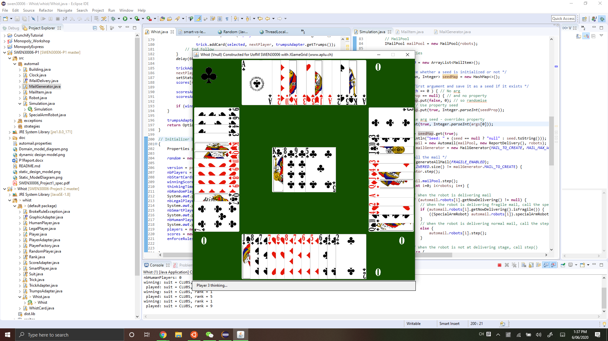

### Hi there 👋

## Here are the projects I worked/am working on:

  

_This is just a screenshot of my private repository. If you would like to review my code, please contact me and I will provide you access._

# Group Projects

## 1. ePortfolio-for-design-student
https://e-portfolio-website.herokuapp.com/

  

    
  

  
#### Description: 
- The ePortfolio is made for a design student (our client) to display his/her artwork online. 
- Main features include: Artwork Gallery, Blog, Store, CMS.
#### Technologies used: 
**Javascript, HTML, CSS, JSX React, MongoDB, Heroku, RESTful**

## 2. Outpost-Defence-Game
- Game Link (play in FullScreen):
  https://outpost-defence.herokuapp.com/
- Game Trailer Video:
  https://www.youtube.com/watch?v=whNglbiKtTw&list=LL&index=6
  
 

   
 

 

   
 

#### Description: 
Outpost Defence is a top-view survival shooter game where the player is trapped in a military outpost in the middle of the desert. He has to fight his way out of waves and waves of enemies who are trying to invade the outpost. Luckily, there are still some weapons and equipments left behind to help him survive the enemy swarm.
#### Technologies used: 
**Unity, C#**

## 3. Vegrify
https://vegrify-team.herokuapp.com/

  

    
  

  
  

    
  

  
  

    
    
  

 
  
#### Description: 
This website is designed to help people identify vegetarian/vegan food products by taking and uploading a photo of the ingredient list, since it is very time-consuming for vegetarians to look up the ingredients one by one whether they are vegetarian-friendly or not. 
#### Technologies used: 
**MERN (MongoDB, Express, React, Node) full-stack, Javascript, HTML, CSS, JSX React, Testing**

## 4. Whist-Card-Game

  

    
  

  
#### Technologies used: 
**Java, UML diagram, Object Oriented Software design patterns/principles**

# Individual Projects

## 1. Web-Crawler

#### Description:
- This project is to crawl a website. I use socket programming, which is fundamental to writing all internet applications, and also about the HTTP application layer protocol. 
- The program will be given a URL on the command line, pointing to an HTML page. The program will be called crawler and it might, for example, be invoked as: crawler http://web1.comp30023 The program will first fetch the indicated HTML page. The program will then recursively follow all hypertext links (href="..." attributes in <a ...> anchor tags) and fetch the indicated pages if all but the first components of the host match the host of the URL on the command line.
  
#### Technologies used: 
**C, HTTP application, Socket API**

## 2. Process-and-Memory-Management

#### Description:
- This project is to write a simulator that allocates processes to a CPU and manages memory allocation among the running processes. 
- Process scheduling algorithms used: First-comg first-served, Round-robin, Shortest Job First.
- Memory Management algorithms used: Swapping, Virtual Memory.
  
#### Technologies used: 
**C, Scheduling Algorithms, Memory Allocation Algorithms**

## 3. Puzzle-Solver

#### Description:
The puzzle is called Wires. It starts with an n by n grid of wire tiles: square tiles with wires pointing in zero, one, or two directions. To solve the puzzle, we need to rotate, or orient, the tiles so that every wire connects with a wire from an adjacent tile (and no wires point towards the edges of the grid). My project is to translate a puzzle instance into a propositional formula to solve the puzzle. 
  
#### Technologies used: 
**Haskell, Propositional Logic**

## 4. Shadow-Bounce-Game

#### Description:
This project is to create a graphical arcade game in the Java programming language. Shadow Bounce is an arcade game where the player must attempt to clear the game board of red pegs with a limited number of shots. Once the board is cleared, the player can progress to the next board, and so on until all boards are cleared or the player runs out of shots, whereupon the game should end. A turn begins when the board is first loaded, and ends when all balls from the turn have fallen of the bottom of the screen. When the turn ends, a new one begins.
  
#### Technologies used: 
**Java, Bagel, UML diagram**

## 5. Case Study: Carton Medical Clinic Database Modelling

#### Description:
Carlton Medical Clinic is located in the vicinity of The University of Melbourne and hence is busy throughout the year especially during the semester. My project is to design a database for an information system to be used by Carlton Medical Clinic.
  
#### Technologies used: 
**SQL, Database Modelling**

## 6. Case Study: Food Nutrient Analysis

#### Description:
This project is to use my Python wrangling skills with a publicly available dataset. The dataset is the food nutrient database from Food Standards Australia and New Zealand1 in the file food nutrient 2011 13 AHS.csv. It contains a detailed breakdown of 51 nutrient values for a wide range of food items. Each nutrient value is presented on a per
100 gram edible portion basis. It was used to support the 2011-13 Australian Health Survey.
- cleanning and visualisation techniques
- processing data
  
#### Technologies used: 
**Python, Jupyter notebook**

<!--
**AngelT99/angelt99** is a ✨ _special_ ✨ repository because its `README.md` (this file) appears on your GitHub profile.

Here are some ideas to get you started:

- 🔭 I’m currently working on ...
- 🌱 I’m currently learning ...
- 👯 I’m looking to collaborate on ...
- 🤔 I’m looking for help with ...
- 💬 Ask me about ...
- 📫 How to reach me: ...
- 😄 Pronouns: ...
- ⚡ Fun fact: ...
-->
