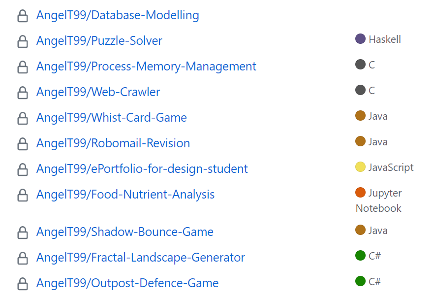
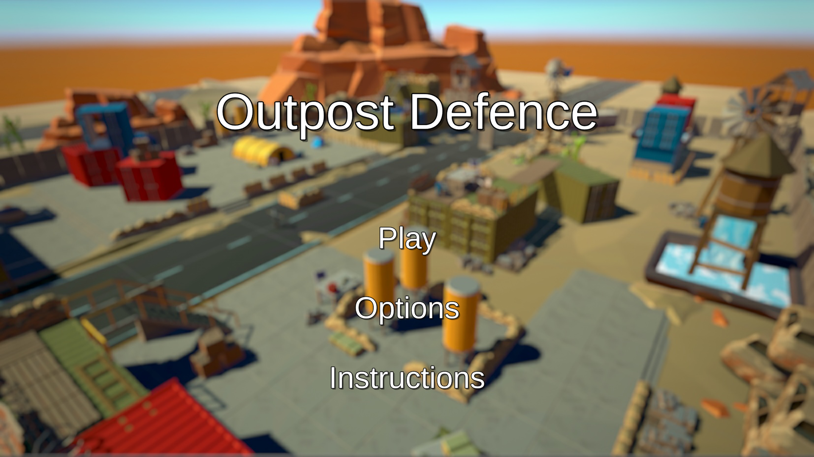
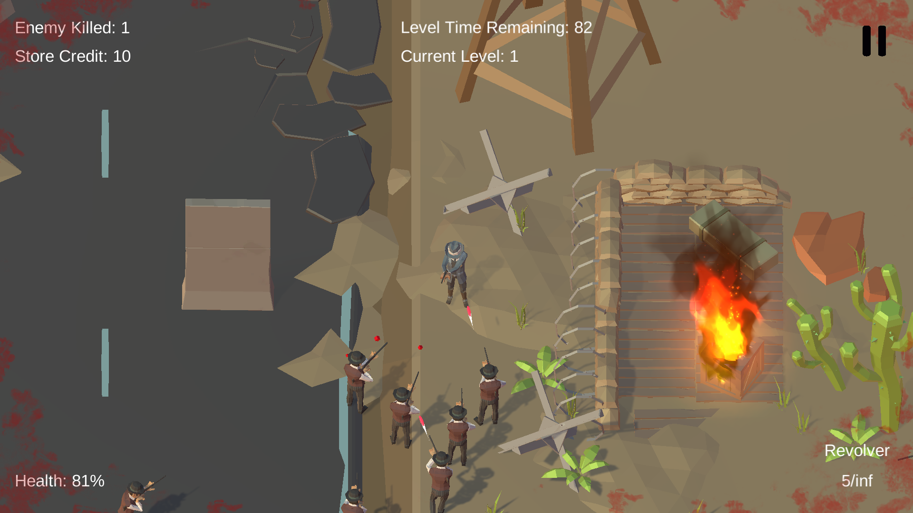
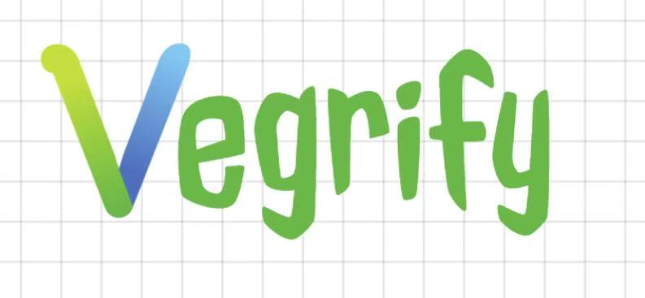
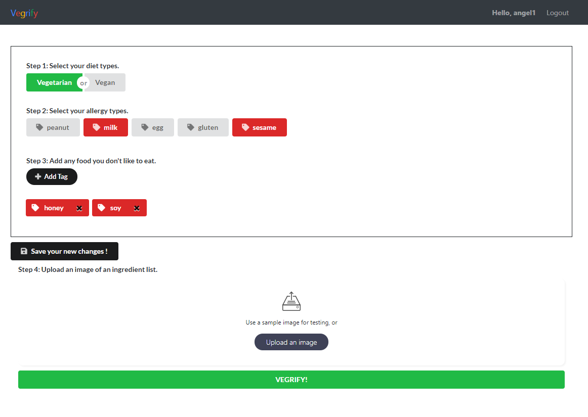
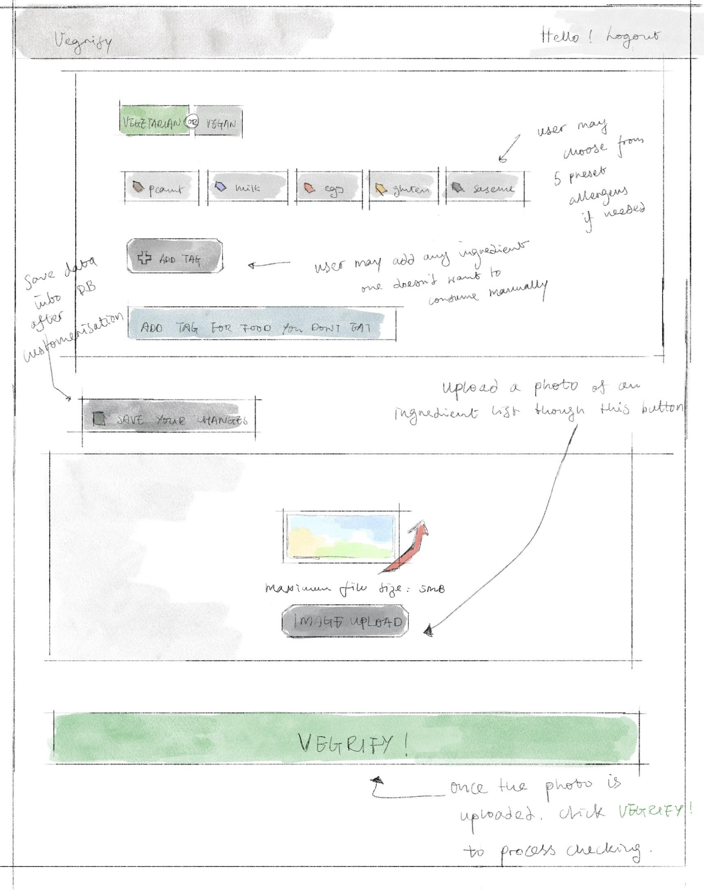
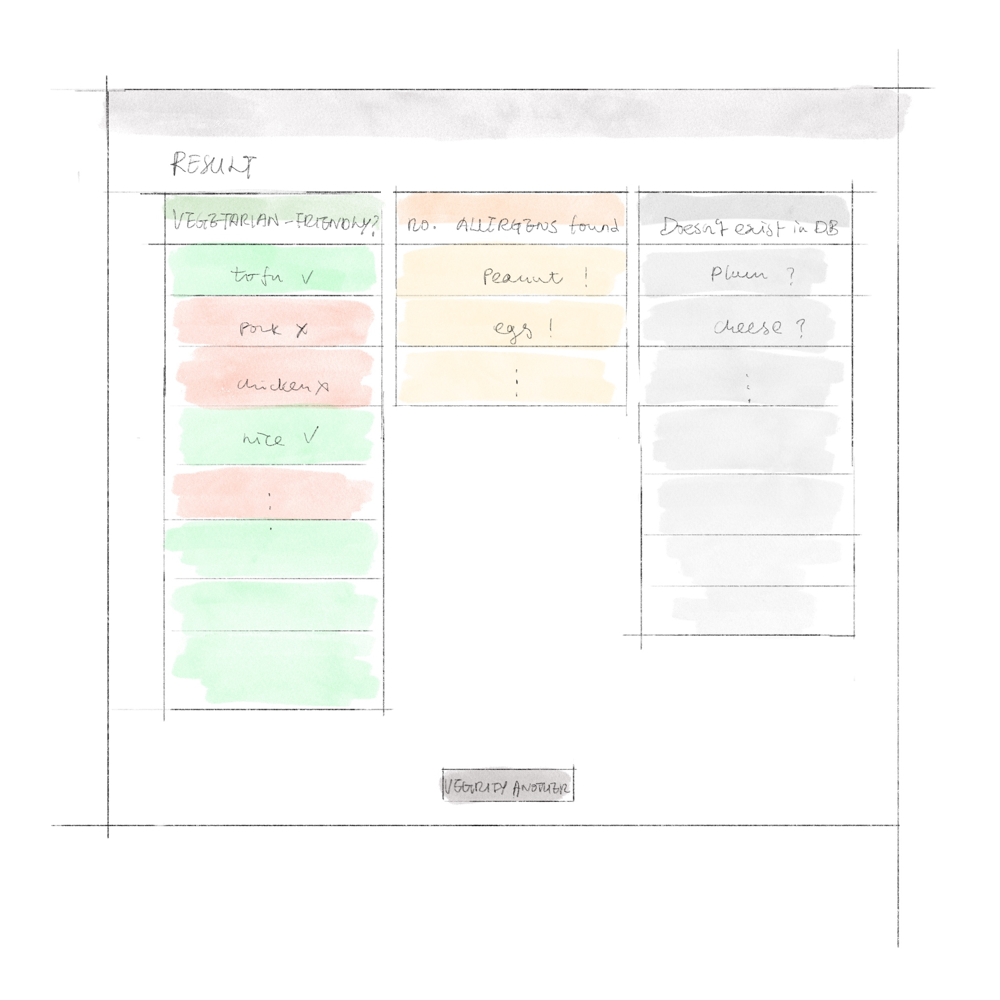

### Hi there 👋

## Here are the projects I worked/working on:

  

_This is just a screenshot of my private repository. If you would like to review my code, please contact me and I will provide you access._

# Group Projects

## ePortfolio-for-design-student
https://e-portfolio-website.herokuapp.com/

  

    
  

  
#### Description: 
- The ePortfolio is made for a design student (our client) to display his/her artwork online. 
- Main features include: Artwork Gallery, Blog, Store, CMS.
#### Technologies used: 
**Javascript, HTML, CSS, JSX React, MongoDB, Heroku RESTful, MVC (Model, View, Control)**

## Outpost-Defence-Game
- Game Link (play in FullScreen):
  https://outpost-defence.herokuapp.com/
- Game Trailer Video:
  https://www.youtube.com/watch?v=whNglbiKtTw&list=LL&index=6
  
 

   
 

 

   
 

#### Description: 
Outpost Defence is a top-view survival shooter game where the player is trapped in a military outpost in the middle of the desert. He has to fight his way out of waves and waves of enemies who are trying to invade the outpost. Luckily, there are still some weapons and equipments left behind to help him survive the enemy swarm.
#### Technologies used: 
**Unity, C#**

## Vegrify
https://vegrify-team.herokuapp.com/

  

    
  

  
  

    
  

  
  

    
    
  

 
  
#### Description: 
This website is to help people identify vegetarian food products from the ingredient lists since it is very time-consuming for vegetarians to look up the ingredients one by one whether they are vegetarian-friendly or not. 
#### Technologies used: 
**MERN (MongoDB, Express, React, Node) full-stack, Javascript, HTML, CSS, JSX React, Testing**

# Individual Projects

<!--
**AngelT99/angelt99** is a ✨ _special_ ✨ repository because its `README.md` (this file) appears on your GitHub profile.

Here are some ideas to get you started:

- 🔭 I’m currently working on ...
- 🌱 I’m currently learning ...
- 👯 I’m looking to collaborate on ...
- 🤔 I’m looking for help with ...
- 💬 Ask me about ...
- 📫 How to reach me: ...
- 😄 Pronouns: ...
- ⚡ Fun fact: ...
-->
